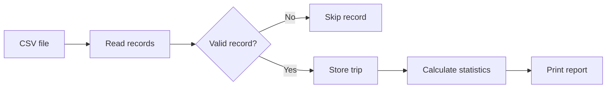

<div align="center">

# Bike-Sharing Trip Analytics

A modular C command-line application for reading bike-sharing trip data from CSV files and generating monthly and overall statistics.


</div>

---

## Overview

Bike-Sharing Trip Analytics reads trip records from a CSV file, validates them and prints a report for January through June.

The report includes:

- number of trips per month;
- longest and shortest trip per month;
- total and average trip duration;
- busiest month.

The program is separated into small C modules for file reading, trip validation, analytics and output.

## Quick Start

### Requirements

- GCC
- Make

### Build and run

```bash
git clone https://github.com/awmiryaw/bike-sharing-trip-analytics.git
cd bike-sharing-trip-analytics
make
make run
```

### Run with another CSV file

```bash
./bike_analytics path/to/trips.csv
```

### Run the tests

```bash
make test
```

Expected result:

```text
All tests passed.
```

## Features

| Feature | Description |
|---|---|
| CSV input | Reads trip records from a CSV file |
| Validation | Skips invalid records instead of stopping the program |
| Monthly analysis | Counts trips from January to June |
| Duration analysis | Calculates total and average trip duration |
| Extremes | Finds the longest and shortest trip in each month |
| Busiest month | Finds the month with the highest number of trips |
| Tests | Includes automated tests for the analytics functions |
| Build system | Uses a Makefile to build, run, test and clean the project |

## Example Input

```csv
trip_id,date,duration
TRIP001,05/01/2026,18
TRIP002,12/01/2026,42
TRIP003,28/01/2026,25
```

The date format is `dd/mm/yyyy`. Duration is stored in minutes.

## Example Output

```text
BIKE SHARING TRIP REPORT

Trips loaded: 12
Total duration: 409 minutes
Average duration: 34.08 minutes
Busiest month: January

Trips by month:

January: 3 trips
Longest trip: TRIP002, 42 minutes
Shortest trip: TRIP001, 18 minutes

February: 2 trips
Longest trip: TRIP004, 31 minutes
Shortest trip: TRIP005, 12 minutes
```

The complete report continues with the remaining months.

## Program Flow



## Project Structure

| Path | Purpose |
|---|---|
| `src/main.c` | Starts the program and prints the report |
| `src/file_reader.c` | Reads trip records from the CSV file |
| `src/trip.c` | Validates trips and extracts the month |
| `src/analytics.c` | Calculates monthly and overall statistics |
| `include/` | Contains the header files |
| `data/sample_trips.csv` | Contains sample input data |
| `tests/test_analytics.c` | Tests the analytics functions |
| `Makefile` | Builds, runs, tests and cleans the project |
| `.gitignore` | Excludes generated files |

## Main Functions

| Function | Purpose |
|---|---|
| `readTrips` | Reads and stores valid records |
| `getMonth` | Extracts the month from a trip date |
| `countTripsByMonth` | Counts trips for every month |
| `longestTripByMonth` | Finds the longest trip in a month |
| `shortestTripByMonth` | Finds the shortest trip in a month |
| `totalDuration` | Calculates total trip duration |
| `averageDuration` | Calculates average trip duration |
| `busiestMonth` | Returns the month with the most trips |

## Design Decisions

- The program uses separate source and header files to keep each responsibility clear.
- Longest and shortest trips are stored as pointers to existing records, avoiding unnecessary copies.
- Invalid records are skipped so one bad CSV row does not stop the full analysis.
- The analytics logic is separated from file input so it can be tested independently.

## Commands

| Command | Action |
|---|---|
| `make` | Compiles the application |
| `make run` | Runs the application with the sample CSV file |
| `make test` | Compiles and runs the tests |
| `make clean` | Removes generated executables |

## Current Scope

The sample project analyses trips from January through June. Date validation checks the expected format and month range, but it is not intended to be a complete calendar-validation library.

## Skills Demonstrated

- Modular C programming
- Structures and pointers
- Arrays and loops
- File input and CSV parsing
- Input validation
- Basic data analytics
- Automated testing
- Makefile-based builds
