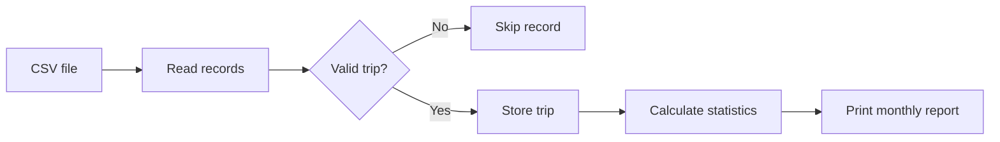

<div align="center">

# Bike-Sharing Trip Analytics

A modular C command-line application that reads bike-sharing trip data from a CSV file and generates monthly and overall statistics.


</div>

---

## Overview

This project processes bike-sharing trip records stored in a CSV file. It validates the input, groups trips by month and prints a report containing trip counts, duration statistics and the longest and shortest trip for each month.

The code is divided into small modules for file reading, trip validation and analytics. It demonstrates structures, arrays, pointers, file handling and modular programming in C.

## Features

- Reads trip records from a CSV file
- Validates records and skips invalid input
- Counts trips from January to June
- Calculates total and average trip duration
- Finds the busiest month
- Finds the longest and shortest trip for every month
- Includes automated tests for the analytics functions
- Uses a Makefile for compilation, execution and cleanup

## Example Output

```text
BIKE SHARING TRIP REPORT

Trips loaded: 12
Total duration: 409 minutes
Average duration: 34.08 minutes
Busiest month: January

Trips by month:

January: 3 trips
Longest trip: TRIP002, 42 minutes
Shortest trip: TRIP001, 18 minutes

February: 2 trips
Longest trip: TRIP004, 31 minutes
Shortest trip: TRIP005, 12 minutes

March: 1 trips
Longest trip: TRIP006, 55 minutes
Shortest trip: TRIP006, 55 minutes

April: 2 trips
Longest trip: TRIP008, 37 minutes
Shortest trip: TRIP007, 20 minutes

May: 2 trips
Longest trip: TRIP009, 46 minutes
Shortest trip: TRIP010, 29 minutes

June: 2 trips
Longest trip: TRIP012, 61 minutes
Shortest trip: TRIP011, 33 minutes
```

## How It Works



1. `file_reader.c` opens the CSV file and reads each record.
2. `trip.c` validates trip values and extracts the month.
3. `analytics.c` calculates monthly and overall statistics.
4. `main.c` prints the final report.

The longest and shortest monthly trips are stored as pointers to records in the original trip array, so the program does not create unnecessary copies.

## Project Structure

```text
bike-sharing-trip-analytics/
├── data/
│   └── sample_trips.csv
├── include/
│   ├── analytics.h
│   ├── file_reader.h
│   └── trip.h
├── src/
│   ├── analytics.c
│   ├── file_reader.c
│   ├── main.c
│   └── trip.c
├── tests/
│   └── test_analytics.c
├── .gitignore
├── Makefile
└── README.md
```

## CSV Format

```csv
trip_id,date,duration
TRIP001,05/01/2026,18
TRIP002,12/01/2026,42
```

| Field | Format | Example |
|---|---|---|
| `trip_id` | Text identifier | `TRIP001` |
| `date` | `dd/mm/yyyy` | `05/01/2026` |
| `duration` | Positive integer in minutes | `18` |

## Build and Run

### Requirements

- GCC
- Make

### Compile

```bash
make
```

### Run with the sample data

```bash
make run
```

### Run with another CSV file

```bash
./bike_analytics path/to/trips.csv
```

### Run the tests

```bash
make test
```

Expected result:

```text
All tests passed.
```

### Remove generated executables

```bash
make clean
```

## Main Functions

| Function | Purpose |
|---|---|
| `readTrips` | Reads and stores valid CSV records |
| `countTripsByMonth` | Counts trips for each month |
| `longestTripByMonth` | Finds the longest monthly trip |
| `shortestTripByMonth` | Finds the shortest monthly trip |
| `totalDuration` | Calculates the total duration |
| `averageDuration` | Calculates the average duration |
| `busiestMonth` | Returns the month with the most trips |

## Skills Demonstrated

- Modular C programming
- Structures and pointers
- Arrays and loops
- File input and CSV parsing
- Input validation
- Basic data analytics
- Automated testing
- Makefile-based builds

